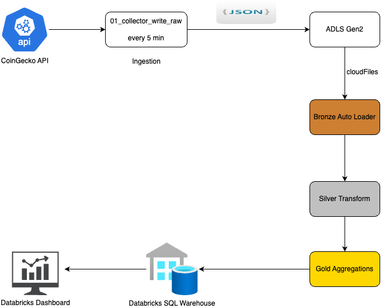
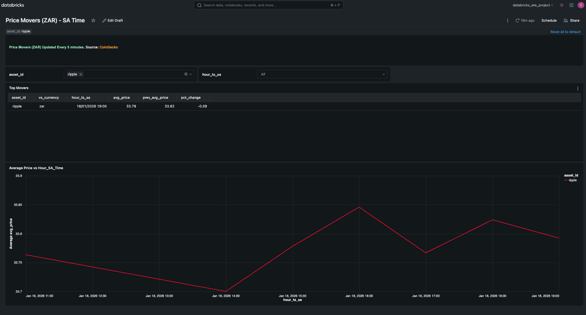
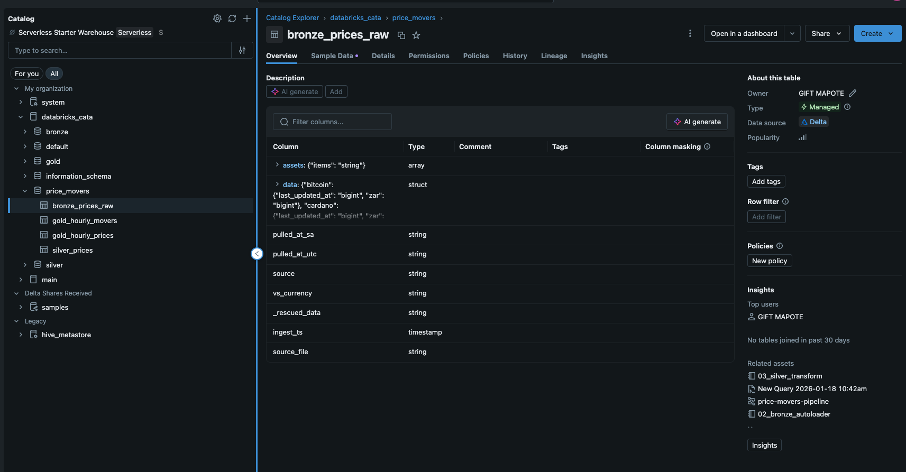

# databricks-price-movers

## Databricks Price Movers (ZAR) — Real-time-ish Crypto Trends in South African Time

## Purpose
Build a production-style data engineering pipeline on **Azure Databricks** that ingests crypto price data, processes it using a **Medallion (Bronze → Silver → Gold) Lakehouse** design, and serves an interactive dashboard.

The dashboard helps you track:
- what is moving **right now**
- how prices **trend over time**
- all displayed in **South African time (Africa/Johannesburg)**
- 

## Problem this project solves
Many portfolio projects stop at a single notebook and don’t show real-world data engineering skills such as:
- ingesting data repeatedly on a schedule
- handling schema drift in semi-structured JSON
- building clean analytical tables (Bronze → Silver → Gold)
- supporting both “current view” and “historical trends”
- delivering outputs that non-technical users can consume (dashboards)

This project addresses those gaps by delivering an end-to-end pipeline that:
1) pulls prices every few minutes from a public API  
2) lands raw files in a data lake (ADLS)  
3) ingests raw data into a Bronze Delta table (Auto Loader)  
4) transforms to clean Silver tables (one row per asset per pull)  
5) computes Gold aggregates and movers in SA time  
6) serves a dashboard that can be refreshed and used daily  

## What you can do with the dashboard
- View **hourly trends** per asset (SA time)
- View **top movers** for the latest hour
- Filter by asset (e.g., Ripple) to inspect trends

> Note: movers require at least two time buckets (for example, two hours) to calculate % change.

## Example use case
A trader, analyst, or fintech team can use this dashboard to quickly identify which assets are gaining or losing momentum and review recent movement history without manually checking multiple exchanges or websites.

## Architecture

## Tech stack
- **Azure Databrics** (notebooks, jobs, Auto Loader, Delta Lake)
- **Azure Data Lake Storage Gen2 (ADLS)** (raw storage)
- **Delta Lake** (Bronze/Silver/Gold tables)
- **Databricks SQL Warehouse** (dashboard queries + visualizations)
- **CoinGecko API** (data source)
- **GitHub** (version control + documentation)

## Data Layers and tables (Medallion)
- **Bronze Layer** : 'bronze_prices_raw' -> raw ingested API records + metadata
- **Silver Layer** : 'silver_prices' -> Normalized rows
- **Gold Laye** : 'gold_hourly_prices' and 'gold_hourly_movers' -> Final Aggregates

## Prerequisites
- Azure Databricks workspace + cluster
- ADLS Gen2 connected
- Unity Catalog
- SQL Warehouse for dashboard

## Notebooks
1. 01_collector_write_raw
2. 02_bronze_autoloader
3. 03_silver_transform
4. 04_gold_aggregations

## Dashboard
Published dashboars (may required Databricks workspace access):
https://adb-7405614192573628.8.azuredatabricks.net/dashboardsv3/01f0f46ca0df17268b1cc0f3ef828920/published?o=7405614192573628

## Project screenshots
### 1) Dashboard overview

### 2) Job Schedule Pipeline

### 3) Medallion tables (Bronze/ Silver/ Gold

